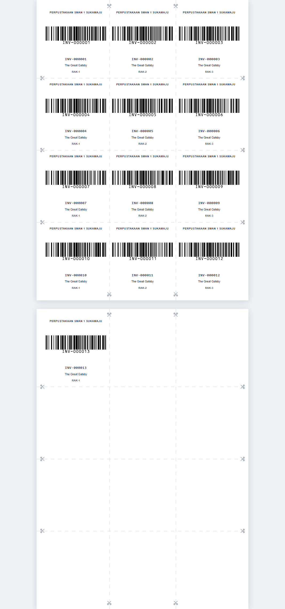
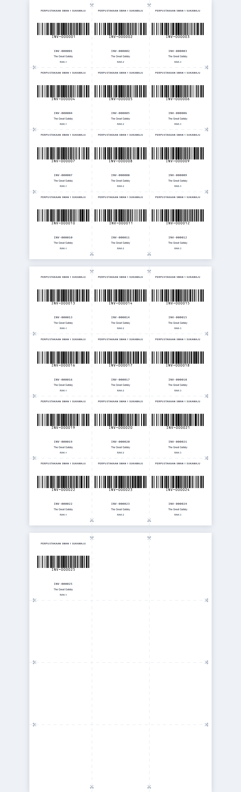

# LABEL_PAGINATION_REFACTOR_REPORT.md

Work Order: **Label Pagination Refactor — 12 Label per Halaman A4 (Final Verification & Closing)**
Mode: Refactor → Implementasi → Validasi (unit + render Electron + print nyata)
Date: 2026-08-02

---

## A. Tujuan Refactor

Mengubah generator label agar menghasilkan **paginate sejati**: setiap **12 eksemplar menjadi satu halaman A4 tersendiri** (`<div class="label-page">` dengan `width:210mm; height:297mm` **tetap**), bukan satu lembar memanjang (`min-height: totalPages × 297mm`). Margin halaman dihitung dari **dimensi fisik A4 (210×297mm)**, dan cut guide / cut mark bersifat **lokal per halaman** (tidak di-offset dengan kelipatan tinggi halaman). Preview tampil seperti **PDF viewer** — lembar A4 putih dengan shadow dan jeda antar halaman.

Batasan yang dijaga ketat:
- **Tidak membuat generator kedua / template kedua / CSS kedua** — satu source of truth.
- **Preview dan print memakai HTML yang sama persis** (`generateLabelsHtml` dipanggil oleh `getLabelPreviewHtml` dan `printBookLabels`).
- **Tidak mengubah** barcode, konten label, DTO, IPC, preload, env.d.ts, maupun `print.service.ts`.

## B. Arsitektur Akhir

Semua perubahan berada di **satu file**: `src/main/services/label.service.ts`.

```
LabelPreviewPage / printBookLabels
        │  (menerima BookLabelData)
        ▼
generateLabelsHtml(data)   ← satu-satunya generator (SSOT)
   ├─ LABEL_PRINT_CONFIG   ← dimensi fisik A4 + margin + grid
   ├─ pageCount = Math.max(1, Math.ceil(items.length / 12))
   ├─ per halaman: .label-page (210mm × 297mm FIXED)
   │     ├─ 12 label (slice per 12)
   │     ├─ 10 cut mark (SVG gunting, lokal halaman)
   │     └─ ::after → cut guide (garis putus-putus, lokal halaman)
   └─ @media print → reset chrome (margin 0, shadow none, body putih)
```

Alur produksi (tidak berubah): `electron/main/services/print.service.ts` → `generateLabelsHtml` yang sama untuk preview dan cetak.

### Konfigurasi akhir

```ts
const LABEL_PRINT_CONFIG = {
  pageWidthMm: 210,   pageHeightMm: 297,          // A4 fisik
  marginLeftMm: 6,    marginRightMm: 6,            // margin kiri/kanan
  marginTopMm: 6,     marginBottomMm: 6,           // margin atas/bawah
  columns: 3, rows: 4, barcodeHeightMm: 37, showLabelBorder: false
}
```

## C. Perhitungan Margin

| Besaran | Rumus | Nilai |
|--------|-------|-------|
| Lebar cetak (`PRINTABLE_WIDTH_MM`) | `pageWidthMm − marginLeftMm − marginRightMm` = 210 − 6 − 6 | **198 mm** |
| Tinggi cetak (`PRINTABLE_HEIGHT_MM`) | `pageHeightMm − marginTopMm − marginBottomMm` = 297 − 6 − 6 | **285 mm** |
| Padding halaman | `marginTop Right Bottom Left` | **6mm 6mm 6mm 6mm** |

Margin 6mm seragam di empat sisi → area label 198×285mm di tengah lembar A4.

## D. Perhitungan Ukuran Label

| Besaran | Rumus | Nilai |
|--------|-------|-------|
| Lebar label (`LABEL_WIDTH_MM`) | `PRINTABLE_WIDTH_MM / columns` = 198 / 3 | **66 mm** |
| Tinggi label (`LABEL_HEIGHT_MM`) | `PRINTABLE_HEIGHT_MM / rows` = 285 / 4 | **71.25 mm** |
| Label per halaman (`LABELS_PER_PAGE`) | `columns × rows` = 3 × 4 | **12** |

## E. Algoritma Pagination

```ts
const pageCount = Math.max(1, Math.ceil(data.items.length / LABELS_PER_PAGE))
const pagesHtml = Array.from({ length: pageCount }, (_, page) => {
  const pageItems = data.items.slice(page * LABELS_PER_PAGE, (page + 1) * LABELS_PER_PAGE)
  const labelsHtml = pageItems.map(...)            // konten label
  const cutMarksHtml = cutMarkPositions().map(...) // 10 cut mark per halaman
  return `<div class="label-page">${labelsHtml}${cutMarksHtml}</div>`
})
```

- Setiap halaman = elemen `.label-page` **terpisah** → flex wrap **reset per halaman** (label selalu mulai kolom 1 baris 1).
- `Math.max(1, …)` → 0 eksemplar tetap menghasilkan 1 halaman.
- `cutMarkPositions()` memakai grid murni (vertikal `x = 72 / 138mm`; horizontal `y = 77.25 / 148.5 / 219.75mm`) — **tanpa offset `page × PAGE_HEIGHT_MM`**, sehingga guide/mark identik dan tidak menyambung antar halaman.

### Struktur halaman & pemecahan kertas

```css
.label-page {
  position: relative;
  width: 210mm;
  height: 297mm;               /* FIXED — 1 halaman A4 */
  margin: 0 auto 32px;         /* jeda antar halaman ala PDF viewer */
  background: #ffffff;
  box-shadow: 0 4px 24px rgba(15, 23, 42, 0.14);
  padding: 6mm 6mm 6mm 6mm;
  page-break-after: always;    /* tiap halaman pindah kertas saat print */
  break-after: page;
}
.label-page:last-of-type { margin-bottom: 0; page-break-after: auto; break-after: auto; }
@media print {
  body { background: #ffffff; }
  .label-page { margin: 0; box-shadow: none; }
}
```

## F. Hasil Pengujian

### F.1 Unit Smoke — `smoke.cjs` (out-of-bundle)

**32/32 PASS** — hitungan halaman, distribusi, geometri, cut mark, guide, page break, dan regresi barcode/data label.

| Skenario | Jumlah Label | Halaman yang Dihasilkan | Distribusi |
|----------|-------------|-------------------------|------------|
| 8 label | 8 | **1 halaman** | [8] |
| 12 label | 12 | **1 halaman** | [12] |
| 13 label | 13 | **2 halaman** | [12, 1] |
| 24 label | 24 | **2 halaman** | [12, 12] |
| 25 label | 25 | **3 halaman** | [12, 12, 1] |

### F.2 Render Electron — `verify.cjs` (Chromium nyata, media screen & print)

**36/36 PASS** — 25 eksemplar / 3 halaman:

- Setiap halaman = **A4 utuh** (793.7×1122.5px @96dpi), `height` **fixed**.
- **Margin identik** di semua halaman: padding `22.68px` (= 6mm); posisi label pertama **identik** `dx=22.67, dy=22.67px`.
- **Halaman berikutnya mulai dari atas kembali** (label pertama di kolom 1 baris 1), terpisah gap **32px** (dy antar halaman = 1154.5px = 1122.5 + 32).
- **Tidak ada label bergeser**: 12/12/1 label per halaman, semua di dalam grid 66×71.25mm.
- **Cut guide hanya pada halaman masing-masing**: probe piksel menemukan garis di dalam tiap halaman; **gap antar halaman bebas guide** (hits=0 → tidak menyambung).
- **Preview identik dengan print**: media print → 3 halaman tetap, `box-shadow:none`, `margin:0`, `body` putih, cut mark 30 tetap, posisi label pertama antar halaman identik.

### F.3 Print Nyata (PDF)

| Skenario | Halaman Fisik PDF |
|----------|-------------------|
| 13 label | **2** halaman PDF |
| 25 label | **3** halaman PDF (`LABEL_PAGINATION_REFACTOR/out_25.pdf`) |

### F.4 Regression Build

| Langkah | Hasil |
|---------|-------|
| `npm run lint` (tsc node + web) | ✅ **PASS** (exit 0) |
| `npm run build` (electron-vite) | ✅ **PASS** (exit 0) — main **1,758.81 kB**, preload 7.15 kB, renderer 902.06 kB |
| Bundle `out/main/index.js` | ✅ memuat `LABELS_PER_PAGE`, `Math.max(1, Math.ceil(...))`, `break-after: page`, reset `:last-of-type` |

## G. Screenshot yang Dihasilkan

Backdrop abu-abu = `body { background: #eef2f7 }` di dalam HTML generator (efek PDF viewer di-render langsung oleh generator). Kedua screenshot memperlihatkan **halaman A4, page gap, halaman berikutnya, margin, dan cut guide**.

### G.1 13 eksemplar → 2 halaman A4 (12 + 1)


### G.2 25 eksemplar → 3 halaman A4 (12 + 12 + 1)


Verifikasi piksel screenshot (`shotcheck.cjs`): sudut = `(238,242,247)` = `#eef2f7` (backdrop abu-abu), interior halaman = putih `(255,255,255)`, gap antar halaman = abu-abu.

## H. Kesimpulan

Refactor **selesai dan siap review PO**. Pagination kini nyata secara struktural (N elemen A4) dan tercetak secara fisik (PDF terpecah sesuai jumlah halaman). Tidak ada perubahan kontrak eksternal (IPC/DTO/preload/print) sehingga preview dan print tetap memakai HTML yang sama. Satu-satunya perubahan kode = `src/main/services/label.service.ts`. Tidak ada TODO/FIXME/console.log sementara/debug code, dan tidak ada file temporary di repository.

**Status: DONE — Architecture Gate BERHENTI**, menunggu review Product Owner (tidak lanjut WO berikutnya).
