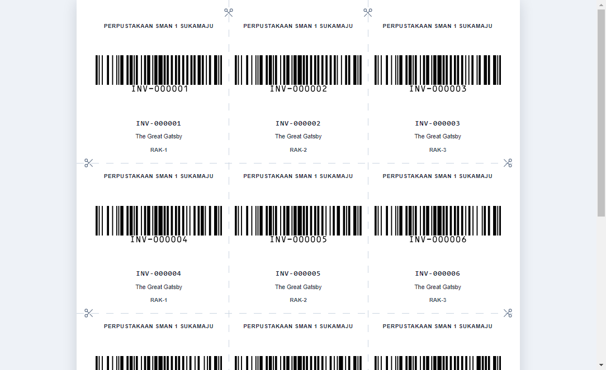
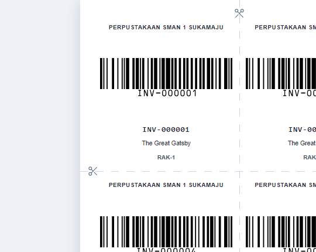
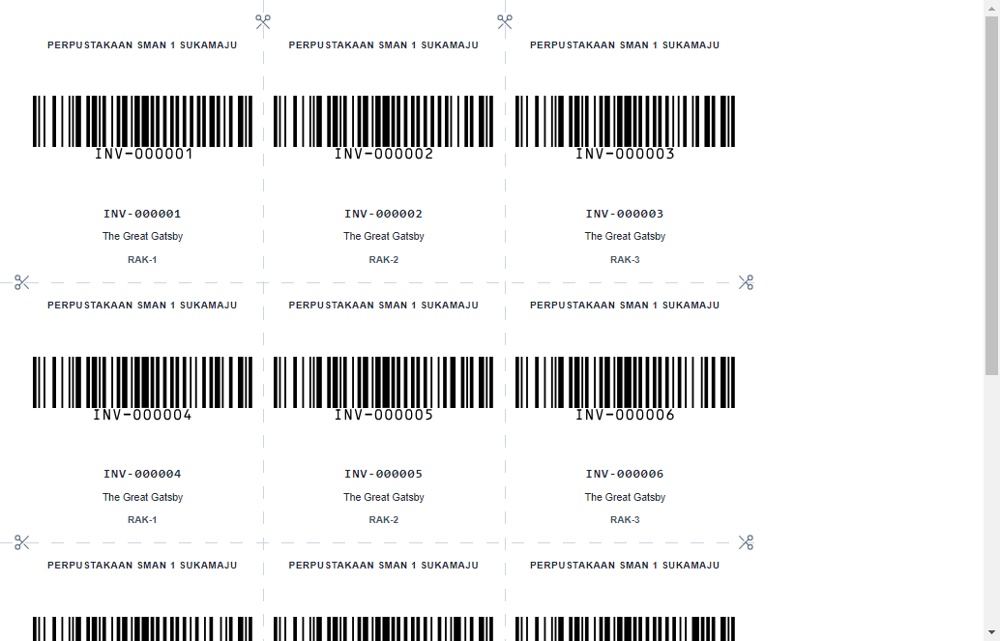

# LABEL_PREVIEW_REFINEMENT_REPORT.md

Work Order: **Label Preview Refinement v1.0**
Mode: Design → Implementasi → Validasi
Date: 2026-08-02

---

## 1. Ringkasan

Pratinjau label kini terlihat seperti **dokumen A4 yang akan dicetak**, bukan HTML biasa yang ditempel di halaman aplikasi. Semua perubahan dilakukan **hanya pada generator label yang sudah ada** (`generateLabelsHtml` di `src/main/services/label.service.ts`) — tidak ada generator kedua, tidak ada template baru, tidak ada CSS kedua. Preview dan print tetap memakai **HTML yang sama persis** (single source of truth).

| WO | Deliverable | Status |
|----|-------------|--------|
| WO-1 | A4 Preview — lembar putih + backdrop abu-abu + shadow + centered | ✅ |
| WO-2 | Layout 3 kolom × 4 baris (12 label/halaman), ukuran dihitung ulang | ✅ (sudah 3×4, diverifikasi) |
| WO-3 | Cut Guide — garis putus-putus horizontal + vertikal, ikut tercetak | ✅ |
| WO-4 | Cut Mark — tanda gunting kecil di awal/akhir garis potong | ✅ |

---

## 2. Perubahan yang Dilakukan

### 2.1 `src/main/services/label.service.ts` (generator — satu-satunya source of truth)

**WO-1 — A4 Preview chrome (screen):**
- `.label-page` → `position: relative; background: #ffffff; box-shadow: 0 4px 24px rgba(15,23,42,0.14); margin: 0 auto` → lembar putih dengan shadow halus, berada di tengah.
- `body` → `background: #eef2f7` (abu-abu muda) sebagai backdrop dokumen.
- Blok `@media print` → reset chrome saat cetak: `body` putih, `.label-page` `margin: 0` + `box-shadow: none` → **chrome (shadow/bg abu-abu) tidak ikut tercetak**, isi label identik.
- Proporsi A4 dipertahankan: `width: 210mm`, `min-height: 297mm` per halaman (multi-halaman: `totalPages × 297mm`).

**WO-2 — Layout 3×4 (12 label/halaman):**
- Konfigurasi sudah ada sejak work order sebelumnya (`LABEL_PRINT_CONFIG`: `columns: 3`, `rows: 4`, `pageMarginMm: 6`). Ukuran label dihitung ulang dari geometri A4: `(210 − 2×6)/3 = 66mm` × `(297 − 2×6)/4 = 71.25mm` → **12 label per halaman**.
- Dukungan multi-halaman: `min-height` menyesuaikan jumlah halaman; guide & cut mark diulang per halaman (buku dengan >12 eksemplar tetap rapi).

**WO-3 — Cut Guide (garis putus-putus, ikut tercetak):**
- Pseudo-elemen `.label-page::after` (absolut, `inset: 0`, `z-index: 5`, `pointer-events: none`) menggambar garis putus-putus via `repeating-linear-gradient` (dash 3.5mm, tebal 0.28mm, warna `#cbd5e1`):
  - 2 garis **vertikal** di `x = 72mm` dan `138mm` (batas antar kolom) — terbentang penuh tinggi lembar.
  - 3 garis **horizontal** per halaman di `y = 77.25 / 148.5 / 219.75mm` (batas antar baris).
- `-webkit-print-color-adjust: exact` + `print-color-adjust: exact` → garis **ikut tercetak** (bersama `printBackground: true` pada jalur cetak yang sudah ada).
- Garis digambar sebagai elemen absolut **di luar flow** → **tidak mengubah ukuran label**.

**WO-4 — Cut Mark (tanda gunting):**
- Helper `cutMarkSvg()` menghasilkan **10 SVG gunting per halaman** (ikon feather scissors, ukuran 5mm, stroke `#64748b`), ditempatkan di titik **awal & akhir** setiap garis potong pada margin luar lembar:
  - Vertikal: atas (rotate 90°) dan bawah (rotate −90°).
  - Horizontal: kiri (rotate 0°) dan kanan (rotate 180°).
- `z-index: 6`, `pointer-events: none` → tidak mengganggu konten.

### 2.2 `src/pages/LabelPreviewPage.tsx` (chrome viewer renderer — minimal)

- Container `.preview-sheet` diubah dari `bg-white shadow-sm border` menjadi polos (`overflow-auto`).
- Alasan: pada injeksi `dangerouslySetInnerHTML`, `<body>` dari HTML hasil generator **dibuang oleh fragment parsing** (perilaku Chromium yang sudah terdokumentasi di `LABEL_PREVIEW_RUNTIME_VERIFICATION.md`), sehingga backdrop abu-abu tidak bisa datang dari `body`. Backdrop abu-abu kini diambil dari `main` (AppLayout `bg-slate-100`), dan lembar putih + shadow datang dari generator. Ini adalah **chrome aplikasi**, bukan CSS label kedua.

### 2.3 Tidak Diubah

- `print.service.ts` (`getLabelPreviewHtml` / `printBookLabels` — keduanya memanggil `generateLabelsHtml` yang sama), IPC `printing:labelPreview` / `printing:bookLabels`, preload, env.d.ts, DTO, `barcode.service.ts`, schema/DB, dependencies.

---

## 3. Screenshot Hasil Preview

Di-render dengan Electron (Chromium produksi) dari output `generateLabelsHtml` yang sama dengan jalur aplikasi.

| Preview (full — simulasi renderer) | Detail (sudut kiri-atas: gunting + garis putus-putus) | Media cetak (chrome reset, guide & gunting tetap) |
|---|---|---|
|  |  |  |

Gambar: lembar A4 putih 210×297mm dengan shadow halus di atas backdrop abu-abu muda, 12 label (3×4), barcode Code128, garis potong putus-putus antar kolom/baris, dan tanda gunting kecil di awal/akhir setiap garis potong. Screenshot print media (kolom kanan) menunjukkan chrome preview (shadow/abu-abu) tidak ikut tercetak, sementara garis & gunting tetap tercetak.

---

## 4. Hasil Validasi

### 4.1 Smoke HTML (compile label.service → assertion) — **36/36 PASS**
Layout 3×4 (12/24 label, 66×71.25mm, min-height 297/594mm) · chrome A4 (bg putih, shadow, margin auto, bg abu-abu) · `@media print` reset · guide vertikal (72/138mm) & horizontal (77.25/148.5/219.75mm, +per halaman) · `print-color-adjust: exact` · 10/20 cut mark · barcode SVG bwip-js 12 · ukuran label konsisten.

### 4.2 Render Verification (Electron — computed style + pixel probe) — **26/26 PASS**
| Check | Hasil |
|-------|-------|
| Preview identik dgn print (HTML sama; media print hanya reset chrome) | ✅ (12 label, 12 barcode, 10 gunting di kedua media) |
| Layout 3×4 ter-render | ✅ 12 label, lembar 793.7×1122.5px (A4) |
| Centered (margin kiri == kanan) | ✅ 136.66px / 136.66px |
| Cut guide tergambar (pixel `#cbd5e1`) | ✅ vertikal 39 hit, horizontal 14 hit |
| Cut guide tetap di media print | ✅ 39 hit |
| Cut mark tergambar (pixel slate-500) | ✅ 44–45 hit |
| Barcode tetap sama | ✅ 12 SVG, height 37mm |
| Ukuran label konsisten | ✅ 66×71.25mm |

### 4.3 Build & Lint
| Check | Hasil |
|-------|-------|
| `npm run lint` | ✅ PASS |
| `npm run build` | ✅ PASS — main 1,758.26 kB · preload 7.15 kB · renderer 902.06 kB |
| Bundle `out/main/index.js` memuat fitur | ✅ `label-cut-mark`, `repeating-linear-gradient(to bottom` |

### 4.4 Matriks Kebutuhan PO
| No | Kebutuhan | Hasil |
|----|-----------|-------|
| 1 | Preview identik dengan hasil print | ✅ (satu HTML, `@media print` hanya setel ulang chrome) |
| 2 | Layout menjadi 3×4 | ✅ 12 label/halaman, 66×71.25mm |
| 3 | Cut guide tampil dengan benar | ✅ putus-putus, horizontal + vertikal, ikut tercetak |
| 4 | Cut mark tampil dengan benar | ✅ 10 gunting di awal/akhir garis potong |
| 5 | Barcode tetap sama | ✅ Code128, height 37mm |
| 6 | Ukuran label konsisten | ✅ |
| 7 | Build PASS | ✅ |
| 8 | Lint PASS | ✅ |

---

## 5. Keputusan

**READY — siap digunakan** untuk review Product Owner.

Catatan untuk PO:
1. **Uji fisik printer tetap disarankan** sebelum rilis (margin 6mm dipakai agar terhindar dari area non-cetak printer; nilai dapat diubah hanya lewat `LABEL_PRINT_CONFIG.pageMarginMm`).
2. Garis potong & gunting sengaja dibuat halus (`#cbd5e1` / `#64748b`) — jelas terlihat saat dicetak namun tidak mengganggu isi label; bila ingin lebih samar/tegas, cukup ubah warna pada konstanta `CUT_GUIDE_COLOR` / `CUT_MARK_COLOR`.
3. Buku dengan >12 eksemplar: guide & gunting otomatis diulang per halaman (12 label/halaman).
